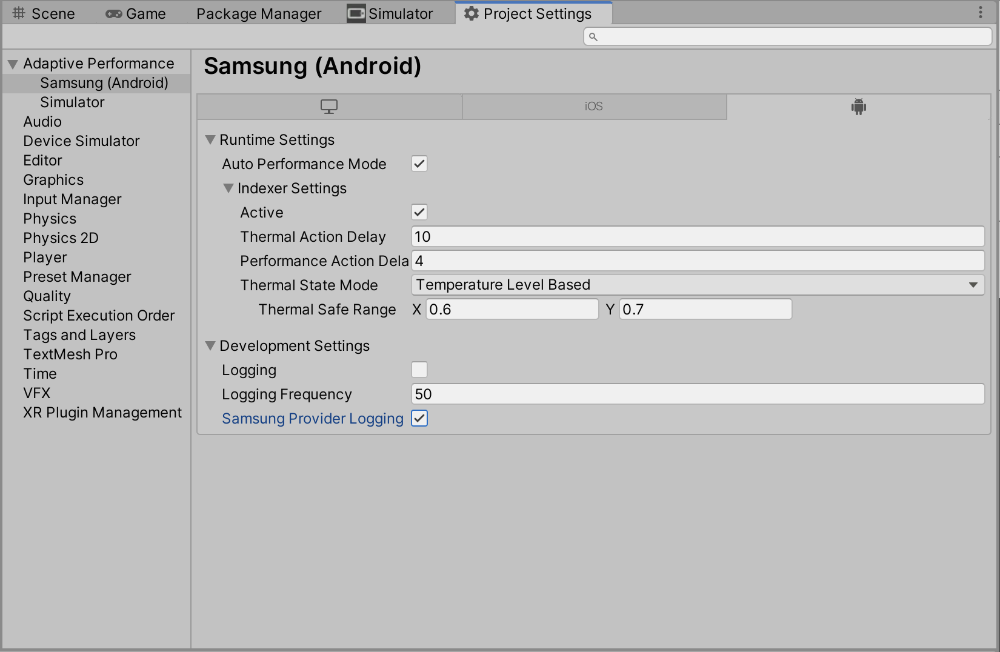

**_Adaptive Performance Samsung Android Guide_**

# About the Adaptive Performance Samsung Android package

The Adaptive Performance Samsung Android provider is a subsystem for [Adaptive Performance](https://docs.unity3d.com/Packages/com.unity.adaptiveperformance@latest/index.html), to extend Adaptive Performance to Samsung Android devices. It transmits device-specific information to the Adaptive Performance package, and enables you to receive data about the thermal state of a Samsung Android device.

This package also provides access to a Variable Refresh Rate API that is supported by newer Samsung devices with high refresh rate displays, see [VRR](vrr.md).

# Installing the Adaptive Performance Samsung Android provider

(During 2.0.0-preview) Use the [Unity Package Manager](https://docs.unity3d.com/Packages/com.unity.package-manager-ui@latest/index.html) to install the **Adaptive Performance Samsung Android** package, which includes the Samsung Android subsystem for Adaptive Performance. Unity automatically installs the Adaptive Performance package as a dependency of the Adaptive Performance Samsung Android package.

To use Adaptive Performance Samsung Android provider you need to install Adaptive Performance and activate the provider in the Adaptive Performance Settings, see [Getting started with Adaptive Performance](https://docs.unity3d.com/Packages/com.unity.adaptiveperformance@latest/index.html).

## Quick Setup Guide

* Install **Android Support** for Unity. Unity needs Android Support to build to your Samsung device.
* **Switch Platform** to Android in the **Build Settings** window.
* (During 2.0.0-preview) Use the Unity Package Manager and install the **Adaptive Performance Samsung Android** package which includes the subsystem. The Unity Package Manager then automatically installs the Adaptive Performance package as a dependency for you as well.
* Install and activate the **Adaptive Performance Samsung Android** provider in Adaptive Performance Settings.
* When you build and deploy the app to your device, Adaptive Performance will be active by default.


**Note:** To enable Adaptive Performance log messages in development builds, change the provider log settings. Adaptive Performance then starts printing status information to the console.



# Using the Adaptive Performance Samsung Android subsystem

This subsystem is only a data provider for Adaptive Performance, and has no user-facing APIs. The Adaptive Performance package includes all functionality. For details, see the [Adaptive Performance](https://docs.unity3d.com/Packages/com.unity.adaptiveperformance@latest/index.html) documentation. There is one exception, see [VRR](vrr.md) for Variable Refresh Rate APIs.

# Technical details
## Device Support

This version of the Adaptive Performance Samsung Android package is compatible with Unity Editor versions 2019 LTS and later (2020.2 and later recommended).

Adaptive Performance Samsung (Android) currently supports the following Samsung devices running Android 9:

* Galaxy S10
* Note 10
* Galaxy Tab S6
* Galaxy Fold

It supports those devices with Samsung GameSDK 1.5 and 1.6.

Adaptive Performance Samsung (Android) currently supports the following Samsung devices running Android 10:

* All old and new Samsung Galaxy models

It supports those devices with Samsung GameSDK 3.0+.

Variable Refresh Rate is currently only supported on Galaxy S20.

## Samsung GameSDK

Adaptive Performance prints the version of the Samsung GameSDK used in the Adaptive Performance Samsung Android subsystem to the console during startup when you enable logging:

```
Adaptive Performance: Subsystem version=3.2
```
